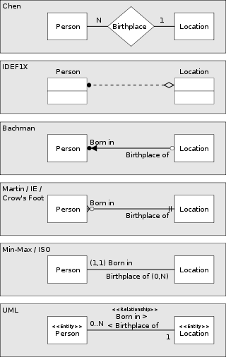
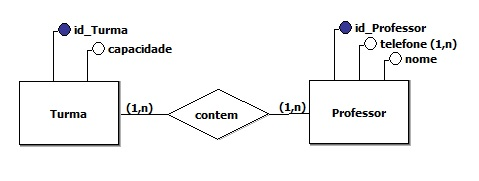
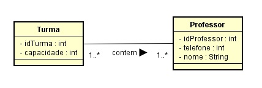
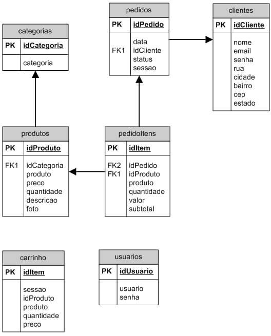

# Banco de Dados

Essa parte do trabalho consite em preparar um banco de dados para o apicativo web.

## Checklist:

- [x] 1.Escolher o tipo de banco de dados (SGBD)

- [x] 2.Selecionar um banco de dados (SGBD)

- [x] 3.Procurar por uma opção de banco de dados gratuito na nuvem

- [x] 4.Realizar a instalação e/ou configuração do banco de dados

- [x] 5.Pesquisar por ferramentas, preferencialmente online, para realizar a modelagem

- [ ] 6.Realizar o modelagem do banco de dados
  
  - [x] 6.1.Criar modelo **Conceitual**
  
  - [ ] 6.2.Criar modelo **Lógico**
  
  - [ ] 6.3.Criar modelo **Físico**

- [ ] 7.Gerar e Carregar o script SQL (DDL) para criação das tabelas e relacionamentos.

- [ ] 8.Inserir dados (cidades e estados) nas tabelas

---

## 1. Escolher o tipo de banco de dados (SGBD)

Essa ecolha tem como referência os bancos de dados do tipo **SQL** (relacionais) e **NoSQL** (não relacionais).

Ambos os tipos possuem suas vantagens e desvantagens.

Sendo que os principais **pontos fortes** de cada um, segundo [esse](https://www.treinaweb.com.br/blog/sql-vs-nosql-qual-usar#:~:text=O%20NoSQL%20%C3%A9%20mais%20indicado,flex%C3%ADvel%20no%20suporte%20de%20dados.) artigo são:

- **SQL** = Consistência de Dados 

- **NoSQL** = Escalabilidade 

Como os dados que serão utilizados, podem ser devidamente agrupados em tabelas relacionais, e não precisam de grande escalabilidade, a escolha será por um banco do tipo relacional (**SQL**)

---

## 2. Selecionar um banco de dados (SGBD)

Alguns pontos que serviram de premissa para a escolha do banco de dados, foram:

- [x] Deveria ser Gratuito,

- [x] Se possível de código aberto (Open-Source)

- [x] Ser multiplataforma

- [x] Possuir uma boa docuemntação e material de consulta na web

Foram encontradas algumas opções que atendessem essas necessidades, onde podemos destacar o MySQL, MariaDB e PostegreSQL .

Dentre essas opções, a escolha foi pelo **MySQL**, por ser amplamente utilizado na web, e também pela facilidade de encontrar tutoriais e materiais relacionados a essa SGBD.

---

## 3. Procurar por uma opção de banco de dados gratuito na nuvem

Para facilitar a manutenção do aplicativo web no ar, seria interessante procurar por possibilidades de hospedagem de banco de dados na nuvem, preferencialmente no modelo SaaS.

Para este projeto, buscou-se os seguintes requisitos:

- [x] Ser, preferencialmente, no modelo SaaS (também conhecido como DBaaS, banco de dados como serviço)

- [x] Ser Gratuito,

- [x] Facilidade de cadastro e criação do banco de dados

- [x] Ter um bom espaço para armazenamento

- [x] Ser permanente (não pode ser versão trial ou banco temporário)

- [x] Ter interface de administração web do banco

Foram realizados alguns testes com os serviços encontrados no site [ilovefreesoftware]([5 Free Websites To Create Free MySQL Database Online](https://www.ilovefreesoftware.com/01/webware/free-websites-create-free-mysql-database-online.html)) e também do [freedb.tech](https://freedb.tech/)

Segue abaixo uma tabela comparativa dos serviços testados:

| Serviço                                               | SaaS               | Gratuito           | Fácil Cadastro | Espaço de<br/>Armazenamento | Durabilidade | Interface Web |
|:----------------------------------------------------- |:------------------:|:------------------:|:--------------:|:---------------------------:|:------------:|:-------------:|
| [freesqldatabase](http://www.freesqldatabase.com/)    | :heavy_check_mark: | :heavy_check_mark: | ⭐⭐⭐            | 5 MB                        | ⭐            | ⭐⭐            |
| [freemysqlhosting](https://www.freemysqlhosting.net/) | :heavy_check_mark: | :heavy_check_mark: | ⭐⭐⭐            | 5 MB                        | ⭐            | ⭐⭐            |
| [db4free](https://www.db4free.net/)                   | :heavy_check_mark: | :heavy_check_mark: | ⭐⭐⭐            | ---                         | ⭐⭐           | ⭐⭐            |
| [freedb.tech](https://freedb.tech/)                   | :heavy_check_mark: | :heavy_check_mark: | ⭐⭐⭐            | 50 MB                       | ⭐⭐⭐          | ⭐⭐⭐           |

Com base na tabela acima, escolhemos o serviço **freedb.tech**

---

## 4. Realizar a instalação e/ou configuração do banco de dados

Como a escolha foi por um banco de dados, no modelo SaaS, foi necessário apenas o cadastro no site [freedb.tech](https://freedb.tech/) e escolher o nome do banco de dados:


Fonte: Próprio autor

---

## 5. Pesquisar por ferramentas, preferencialmente online, para realizar a modelagem

Segue abaixo uma relação de opções on-line, e preferencialmente gratuitas, para realizar essa modelagem:

- [draw.io](https://drawio-app.com/entity-relationship-diagrams-with-draw-io/)

- [Lucidchart](https://www.lucidchart.com/pages/pt/modelos/diagrama-er)

- [ERDPlus](https://erdplus.com/standalone)

- [GitMind](https://gitmind.com/erd-examples.html)

- [VisualParadigm](https://online.visual-paradigm.com/pt/diagrams/features/chen-entity-relationship-diagram-tool/)

- [dbdiagram.io](https://dbdiagram.io/home)

- [dynobird](https://dynobird.com/) - sucessor do projeto https://dbdesigner.id/

---

## 6. Realizar o modelagem do banco de dados

Antes de iniciar a criação das tabelas no banco de dados, deve-se realizar o seu modelamento.

De acordo com [esse](https://livrodigital.uniasselvi.com.br/GTI11_principios_de_banco_de_dados/unidade2.html?topico=1) livro on-line, a modelagem de dados é definida, como sendo um conjunto de conceitos utilizados para descrever a estrutura de uma base de dado.

Tendo como objetivo:

> criar uma abstração da realidade que seja capaz de registrar os 
> acontecimentos, de forma que seja possível programar um sistema que 
> atenda às devidas necessidades e informações esperadas pelo usuário

 A criação dos modelos são baseados em três níveis:

- Conceitual,
- Lógico e
- Físico.

Segue uma tabela comparativa entre as características de cada modelo, conforme podemos ver [aqui](https://pt.stackoverflow.com/questions/294699/qual-a-diferen%C3%A7a-entre-modelagem-conceitual-l%C3%B3gica-e-f%C3%ADsica)

| Característica               | Conceitual | Lógico | Físico |
| ---------------------------- |:----------:|:------:|:------:|
| Nome das Entidades           | ✔️         | ✔️     | ✔️     |
| Relacionamento das Entidades | ✔️         | ✔️     | ✔️     |
| Atributos                    | ✔️         | ✔️     | ✔️     |
| Chave Primária               |            | ✔️     | ✔️     |
| Chave Estrangeira            |            | ✔️     | ✔️     |
| Nome das Tabelas             |            |        | ✔️     |
| Nome das Colunas             |            |        | ✔️     |
| Tipo das Colunas             |            |        | ✔️     |

Tabela adaptada [desta](https://i.stack.imgur.com/Qe0wH.png) imagem, encontrada neste [site](https://pt.stackoverflow.com/questions/294699/qual-a-diferen%C3%A7a-entre-modelagem-conceitual-l%C3%B3gica-e-f%C3%ADsica)

---

### - Modelo **Conceitual**

Nessa etapa serão criados gráficos para o MER (Modelo Entidade Relacionamento), desenvolvido por Peter Chen, conforme podemos ver [aqui](https://www.vertabelo.com/blog/chen-erd-notation/). Essa represantação gráfica do MER é denominada ERD (Entity-Relationship Diagram), ou DER (Diagrama Entidade Relacionamento).

Temos uma descrição bem detalhada deste tipo de diagrama no seguinte link: [Chen Notation | Vertabelo Database Modeler](https://www.vertabelo.com/blog/chen-erd-notation/)

Existem outras formas de representar o modelo conceitual, conforme podemos ver abaixo:



Fonte: [https://pt.stackoverflow.com/questions/294699/qual-a-diferença-entre-modelagem-conceitual-lógica-e-física](https://pt.stackoverflow.com/questions/294699/qual-a-diferen%C3%A7a-entre-modelagem-conceitual-l%C3%B3gica-e-f%C3%ADsica)

Sendo que os dois diagramas mais utilizados para essa representação, conforme podemos ver [aqui](http://spaceprogrammer.com/bd/introducao-ao-modelo-de-dados-e-seus-niveis-de-abstracao/) são o Diagrama de Entidade e Relacionamento (também conhecido como diagrama de Peter Chain) e Diagrama de Classes UML.

**Exemplo:** DER - Diagrama de Entidade e Relacionamento



Fonte: http://spaceprogrammer.com/bd/introducao-ao-modelo-de-dados-e-seus-niveis-de-abstracao/

**Exemplo:** Diagrama de Classe UML



Fonte: http://spaceprogrammer.com/bd/introducao-ao-modelo-de-dados-e-seus-niveis-de-abstracao/

Esse é o modelo de mais alto nível, totalmente agnóstico de tecnologias ou banco de dados que serão utilizados. O foco deste modelo é discutir os aspectos de negócio, conforme podemos ver [aqui](https://www.luis.blog.br/modelagem-de-dados-modelo-conceitual-modelo-logico-e-fisico.html). 

---

### - Modelo **Lógico**

Esse modelo descreve como os dados serão armazenados no banco e também seus relacionamentos, conforme vemos [aqui](http://spaceprogrammer.com/bd/introducao-ao-modelo-de-dados-e-seus-niveis-de-abstracao/).

Neste momento escolhemos o tipo de tecnologia, ou tipo de banco de dados que será escolhido, como por exemplo: relacional, orientado a objetos, orientado a colunas, entre outros.

Também definimos as chaves primárias e estrangeiras, realizamos a normalização, cuidamos da integridade referencial, entre outras, conforme vemos [aqui](http://spaceprogrammer.com/bd/introducao-ao-modelo-de-dados-e-seus-niveis-de-abstracao/).

O modelo lógico é criado levando em consideração a modelagem realizada no modelo conceitual.

**Exemplo:** Modelo Lógico



Fonte: https://www.luis.blog.br/modelagem-de-dados-modelo-conceitual-modelo-logico-e-fisico.html

---

### - Modelo **Físico**

Nesta etapa leva-se em consideração as caracteristicas do SGBD escolhido.

Então tendo como base o modelo lógico, realizamos as adaptações nos nomes das tabelas e colunas, se necessário.

Também inserimos os tipos de dados, de acordo com as regras e possibilidades fornecidas pelo do SGBD.

Esse modelo pode ser representado de forma gráfica, sendo uma representação semelhante ao modelo lógico, mas incluindo os demais detalhes e tipos referentes ao SGBD escolhido.

E também pode ser apresentado na forma de instruções SQL, visto que ele tem a finalidade de implantação do banco de dados.

**Exemplo:** Código SQL para criação de objetos no banco de dados:

```sql
CREATE TABLE `turma` (
`idturma` INTEGER(4) NOT NULL AUTO_INCREMENT,
`capacidade` INTEGER(2) NOT NULL,
`idProfessor` INTEGER(4) NOT NULL,
PRIMARY KEY (`idturma`),
FOREIGN KEY(`idProfessor`) REFERENCES professor(idProfessor),
UNIQUE KEY `idturma` (`idturma`)
)
```

Fonte: http://spaceprogrammer.com/bd/introducao-ao-modelo-de-dados-e-seus-niveis-de-abstracao/ 

---

### 6.1.Criar modelo **Conceitual**

Segue o modelo conceitual, realizado com o auxilio da ferramenta [ERDPlus](https://erdplus.com/)

---

### 6.2.Criar modelo **Lógico**

Segue o modelo lógico, realizado com o auxílio da ferramenta [DynoBird](https://app.dynobird.com)

---

### 6.3.Criar modelo **Físico**

---

## Referências Gerais

- [Livro Digital - Unidade 2](https://livrodigital.uniasselvi.com.br/GTI11_principios_de_banco_de_dados/unidade2.html?topico=1)

- [What is Entity-Relationship Diagram (ERD)? - Software Ideas Modeler](https://www.softwareideas.net/what-is-erd-diagram-in-data-modeling)

- [https://pt.stackoverflow.com/questions/294699/qual-a-diferença-entre-modelagem-conceitual-lógica-e-física](https://pt.stackoverflow.com/questions/294699/qual-a-diferen%C3%A7a-entre-modelagem-conceitual-l%C3%B3gica-e-f%C3%ADsica)

- [Modelagem de Bancos de Dados: Conceitual, Lógica e Física](http://spaceprogrammer.com/bd/introducao-ao-modelo-de-dados-e-seus-niveis-de-abstracao/)

- [Modelagem de dados: modelo conceitual, modelo lógico e físico](https://www.luis.blog.br/modelagem-de-dados-modelo-conceitual-modelo-logico-e-fisico.html)

- [Modelagem de dados – Wikipédia, a enciclopédia livre](https://pt.wikipedia.org/wiki/Modelagem_de_dados)

- [ERD Notations in Data Modeling | Vertabelo Database Modeler](https://vertabelo.com/blog/comparison-of-erd-notations/)

- https://openenergy-platform.org/tutorials/jupyter/UML_Workshop/?utm_source=pocket_mylist