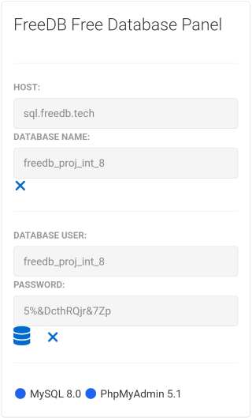

# Banco de Dados

Essa parte do trabalho consite em preparar um banco de dados para o apicativo web.

## Checklist:

- [x] 1.Escolher o tipo de banco de dados (SGBD)

- [x] 2.Selecionar um banco de dados (SGBD)

- [x] 3.Procurar por uma opção de banco de dados gratuito na nuvem

- [x] 4.Realizar a instalação e/ou configuração do banco de dados

- [ ] 5.Realizar o modelagem do banco de dados
  
  - [ ] 5.1.Criar modelo **Conceitual**
  
  - [ ] 5.2.Criar modelo **Lógico**
  
  - [ ] 5.3.Criar modelo **Físico**

- [ ] 6.Gerar e Carregar o script SQL (DDL) para criação das tabelas e relacionamentos.

- [ ] 7.Inserir dados (cidades e estados) nas tabelas

---

## 1. Escolher o tipo de banco de dados (SGBD)

Essa ecolha tem como referência os bancos de dados do tipo **SQL** (relacionais) e **NoSQL** (não relacionais).

Ambos os tipos possuem suas vantagens e desvantagens.

Sendo que os principais **pontos fortes** de cada um, segundo [esse](https://www.treinaweb.com.br/blog/sql-vs-nosql-qual-usar#:~:text=O%20NoSQL%20%C3%A9%20mais%20indicado,flex%C3%ADvel%20no%20suporte%20de%20dados.) artigo são:

- **SQL** = Consistência de Dados 

- **NoSQL** = Escalabilidade 

Como os dados que serão utilizados, podem ser devidamente agrupados em tabelas relacionais, e não precisam de grande escalabilidade, a escolha será por um banco do tipo relacional (**SQL**)

---

## 2. Selecionar um banco de dados (SGBD)

Alguns pontos que serviram de premissa para a escolha do banco de dados, foram:

- [x] Deveria ser Gratuito,

- [x] Se possível de código aberto (Open-Source)

- [x] Ser multiplataforma

- [x] Possuir uma boa docuemntação e material de consulta na web

Foram encontradas algumas opções que atendessem essas necessidades, onde podemos destacar o MySQL, MariaDB e PostegreSQL .

Dentre essas opções, a escolha foi pelo **MySQL**, por ser amplamente utilizado na web, e também pela facilidade de encontrar tutoriais e materiais relacionados a essa SGBD.

---

## 3. Procurar por uma opção de banco de dados gratuito na nuvem

Para facilitar a manutenção do aplicativo web no ar, seria interessante procurar por possibilidades de hospedagem de banco de dados na nuvem, preferencialmente no modelo SaaS.

Para este projeto, buscou-se os seguintes requisitos:

- [x] Ser, preferencialmente, no modelo SaaS (também conhecido como DBaaS, banco de dados como serviço)

- [x] Ser Gratuito,

- [x] Facilidade de cadastro e criação do banco de dados

- [x] Ter um bom espaço para armazenamento

- [x] Ser permanente (não pode ser versão trial ou banco temporário)

- [x] Ter interface de administração web do banco

Foram realizados alguns testes com os serviços encontrados no site [ilovefreesoftware]([5 Free Websites To Create Free MySQL Database Online](https://www.ilovefreesoftware.com/01/webware/free-websites-create-free-mysql-database-online.html)) e também do [freedb.tech](https://freedb.tech/)

Segue abaixo uma tabela comparativa dos serviços testados:

| Serviço                                               | SaaS               | Gratuito           | Fácil Cadastro     | Espaço de Armazenamento | Durabilidade | Interface Web |
|:----------------------------------------------------- |:------------------:|:------------------:|:------------------:|:---------------------------:|:------------:|:-------------:|
| [freesqldatabase](http://www.freesqldatabase.com/)    | :heavy_check_mark: | :heavy_check_mark: | :star::star::star: | 5 MB                        | ⭐            | ⭐⭐            |
| [freemysqlhosting](https://www.freemysqlhosting.net/) | :heavy_check_mark: | :heavy_check_mark: | :star::star::star: | 5 MB                        | ⭐            | ⭐⭐            |
| [db4free](https://www.db4free.net/)                   | :heavy_check_mark: | :heavy_check_mark: | :star::star::star: | ---                         | ⭐⭐           | ⭐⭐            |
| [freedb.tech](https://freedb.tech/)                   | :heavy_check_mark: | :heavy_check_mark: | :star::star::star: | 50 MB                       | ⭐⭐⭐          | ⭐⭐⭐           |

Com base na tabela acima, escolhemos o serviço **freedb.tech**

---

## 4. Realizar a instalação e/ou configuração do banco de dados

Como a escolha foi por um banco de dados, no modelo SaaS, foi necessário apenas o cadastro no site [freedb.tech](https://freedb.tech/) e escolher o nome do banco de dados:

---

## 5. Realizar o modelagem do banco de dados

### 5.1.Criar modelo **Conceitual**
  
### 5.2.Criar modelo **Lógico**
  
### 5.3.Criar modelo **Físico**

---